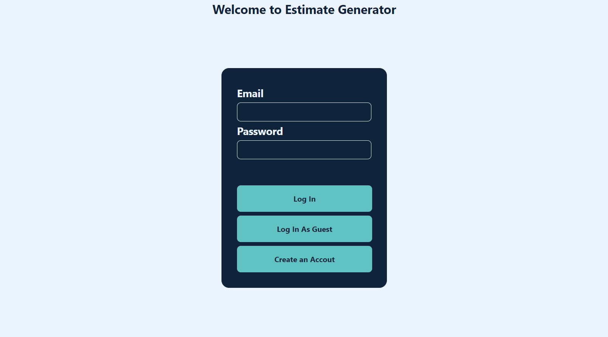
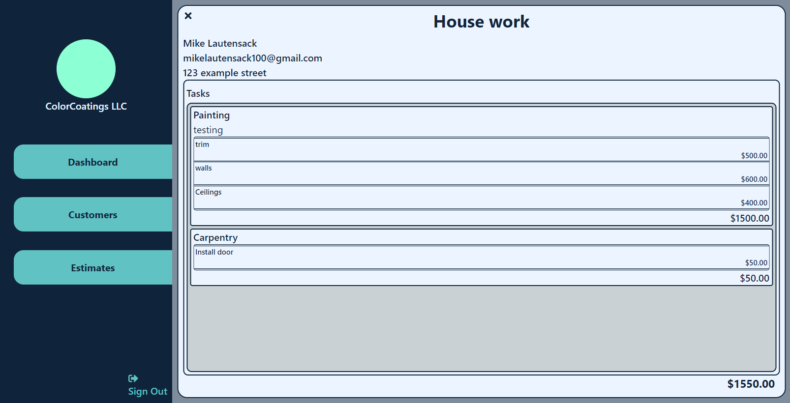

# Welcome to Estimate Generator - Pre Alpha

## Description

If you have ever been a contractor and had to spend hours writing up boring estimates for customers only to have them ask for revision after revision you know how much of a pain writing estimates can be. If only there was a quick easy way for contractors to create, save, edit and send estimates to customers. Estimate Genarator is a web app for contractors and small buisness for creating, manageing & sending esitimates to customers quickly and easily. Estimate Generator lets contractors and/or small buisness's create and store a lists of customers and estimates. Estimates can be sent to customers via email. Estimate Genertor makes it easy for you to make revisions to your estimates and resend thoes estimates when customers request. Estimate Generator will save the individual contractor or small business many hours writing, revising and sending esimates manually.

---

## Features and Functions

- User accounts
- Users can create customers and store customer information like ... name, email, phone, address ect...
- Users can create and save and send estimates for various types of contracting work
- Users can send the esitimates to customers via email

---

## Technical Information

- This app is build with the MERN stack
- The frontend is build with React and vinilla css
- React-Router v6 used for routing
- React-hook-form and Yup librarys were used for forms
- Axios is being used for api requests
- The backend is build with NodeJS and Express
- Databased used is MongoDB Atlis Cloud
- JWT Auth

---

## Coming Soon!

#### Estimate Genarator is currently in pre-alpha. Here is a list of features that users can expect in the alpha build.

##### Features

- [] Sending estimates via email
- [] Add user account and settings pages
- [] Fully update/redesign UI

---

## Gallery

### Home Screen

### Regester User

.png>)

### Dashbaord

.png>)

### Customers Page

.png>)

### Customer Form

.png>)

### Estimates Page

.png>)

### Estimate

### Estimate Form

.png>)

### Task Form

.png>)

### Subtask Form

.png>)
